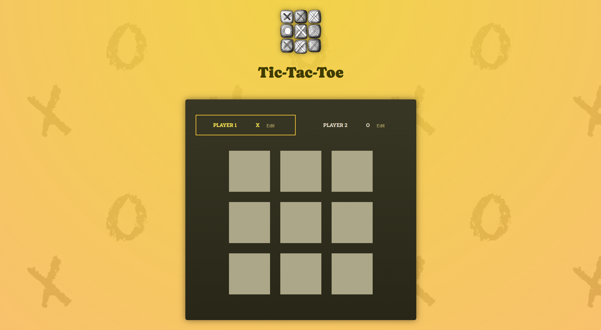
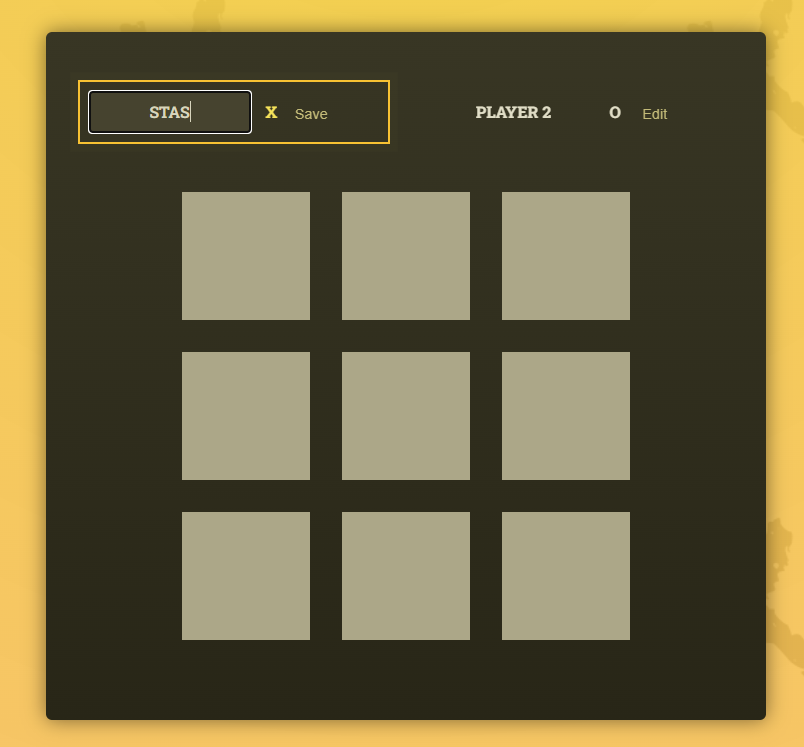
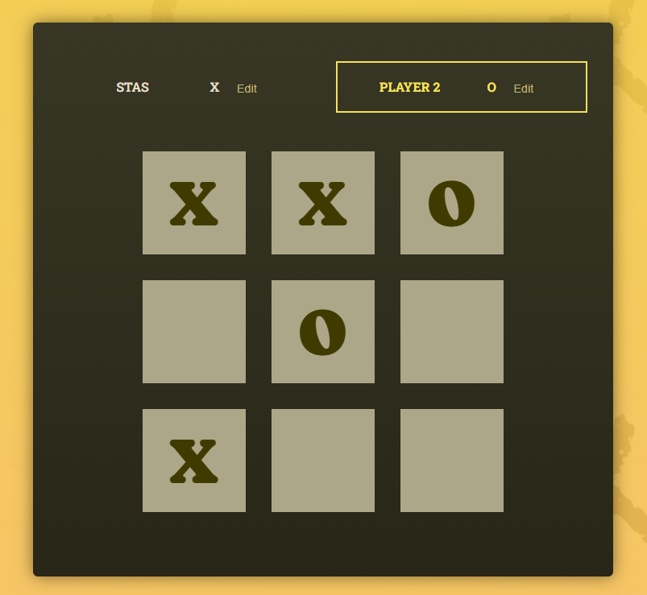
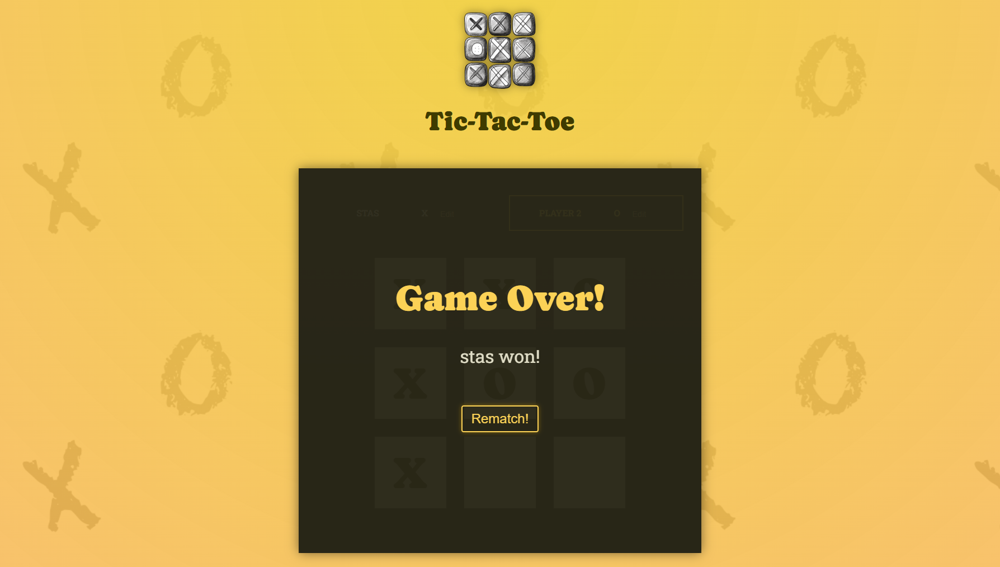
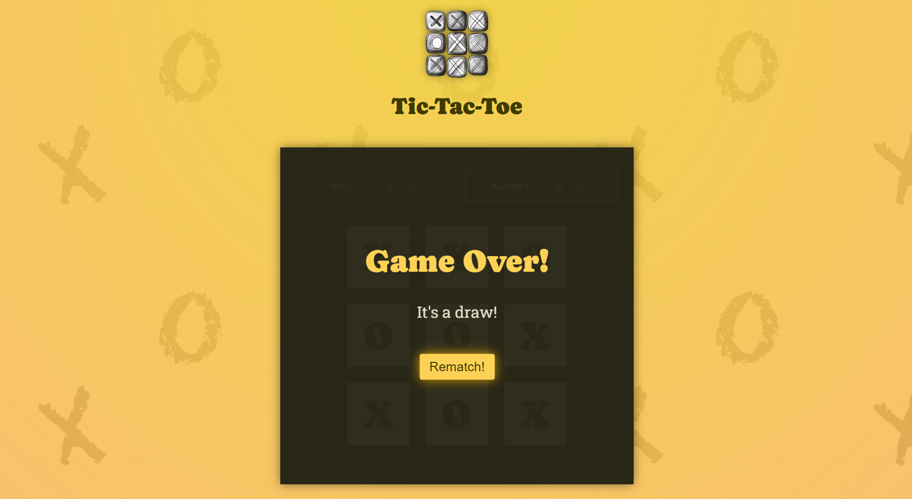

# Tic-Tac-Toe

A small **Tic-Tac-Toe game built with React** as a learning project.

The main goal of this project was to practice React fundamentals and understand how components, state, props, events, and derived data work together in a real interactive application.

---

## 🎮 About the Project

This application implements the classic **Tic-Tac-Toe** game for two players.

Players can change their names, take turns placing symbols on the board, follow the move history, and start a new game after a win or draw.

### Features

* 🎯 Two-player Tic-Tac-Toe
* ✏️ Editable player names
* 🔄 Active player indication
* 📜 Game move history
* 🏆 Winner detection
* 🤝 Draw detection
* 🔁 Rematch functionality

---

## 🛠 Tech Stack

| Technology           | Purpose                                      |
| -------------------- | -------------------------------------------- |
| **React 19**         | UI and component-based application structure |
| **JavaScript / JSX** | Application logic and component markup       |
| **Vite**             | Development server and build tool            |
| **CSS**              | Styling                                      |
| **ESLint**           | Code quality and linting                     |

---

## 🧠 What I Practiced

While building this project, I practiced several core React concepts:

* Component composition
* Working with `useState`
* Passing data through props
* Event handling
* Updating state based on previous state
* Derived state
* Conditional rendering
* Rendering dynamic lists
* Separating UI and application logic into reusable components

The project helped me better understand how state changes affect the UI and how different React components communicate with each other.

---

## 🚀 Getting Started

### Prerequisites

Make sure you have **Node.js** and **npm** installed.

### 1. Clone the repository

```bash id="e0c937"
git clone https://github.com/spavlishyn-tp/react-project.git
```

### 2. Open the project

```bash id="4db25f"
cd react-project
```

### 3. Install dependencies

```bash id="7959a5"
npm install
```

### 4. Start the development server

```bash id="8b0d62"
npm run dev
```

Vite will display the local development URL in the terminal.

Open it in your browser and start playing.

---

## 📦 Production Build

To create a production build:

```bash id="62ddd2"
npm run build
```

The generated production files will be placed in the `dist` directory.

---

## 📸 Screenshots

Game Overview

<p align="center">  </p>

<p align="center"> <em>Main game board with players, game field and move history.</em> </p>

Player Interaction

<table> <tr> <td align="center" width="50%">  </td> <td align="center" width="50%">  </td> </tr> <tr> <td align="center"> <strong>Player Name Editing</strong> </td> <td align="center"> <strong>Gameplay</strong> </td> </tr> <tr> <td align="center"> Players can edit their names before or during the game. </td> <td align="center"> The board updates dynamically after every player move. </td> </tr> </table>

Game Results

<table> <tr> <td align="center" width="50%">  </td> <td align="center" width="50%">  </td> </tr> <tr> <td align="center"> <strong>Winner</strong> </td> <td align="center"> <strong>Draw</strong> </td> </tr> <tr> <td align="center"> The game detects the winning combination and displays the winner. </td> <td align="center"> A draw is detected when all fields are filled without a winner. </td> </tr> </table>


---


